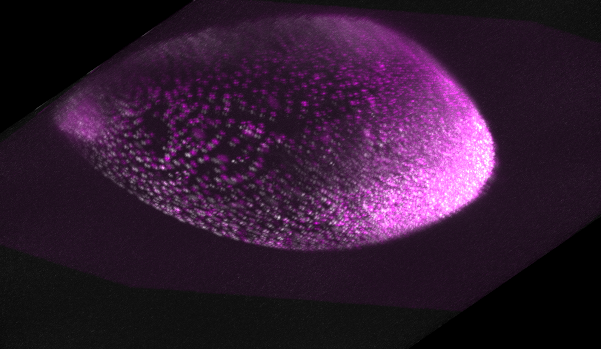

# 3D Image Fusion for Microscopy Data (Zarr)

This Python script performs 3D image registration between two volumes (views) extracted from a 5D Zarr dataset from DaXi microscope.

The process utilizes **SimpleITK** for the registration algorithm (based on Mutual Information) and **Napari** for an interactive 3D visualization of the final result.



## 🎯 Features

* Loads multidimensional data directly from a Zarr file.
* Extracts two specific 3D volumes (views) from a single time point (`T_INDEX`).
* Performs a downsampling pre-processing step to speed up registration.
* Uses the robust SimpleITK registration framework to find a rigid (`Euler3DTransform`) transformation.
* Applies the calculated transform to align the "moving image" (View 1) to the "fixed image" (View 0).
* Launches Napari for an interactive visualization, overlaying the original and aligned images with different colors for easy inspection.

---

## 🛠️ Installation

To run this script, you will need a Python environment with the libraries listed below.

1.  **Clone this repository (or save the script):**
    ```bash
    git clone [https://github.com/bgabiz/cz_biohub_challenge.git](https://github.com/bgabiz/cz_biohub_challenge.git)
    ```

2.  **Create a virtual environment (Recommended):**
    ```bash
    python3 -m venv venv
    source venv/bin/activate
    ```

3.  **Install the dependencies:**
    You can install the required libraries directly with `pip`.
    ```bash
    pip install -r requirements.txt
    ```

---

## 🚀 Usage

The script is executed from the command line, requiring a single argument: the path to the input Zarr file.

```bash
python zarr_image_fusion.py --input /path/to/your/dataset.zarr